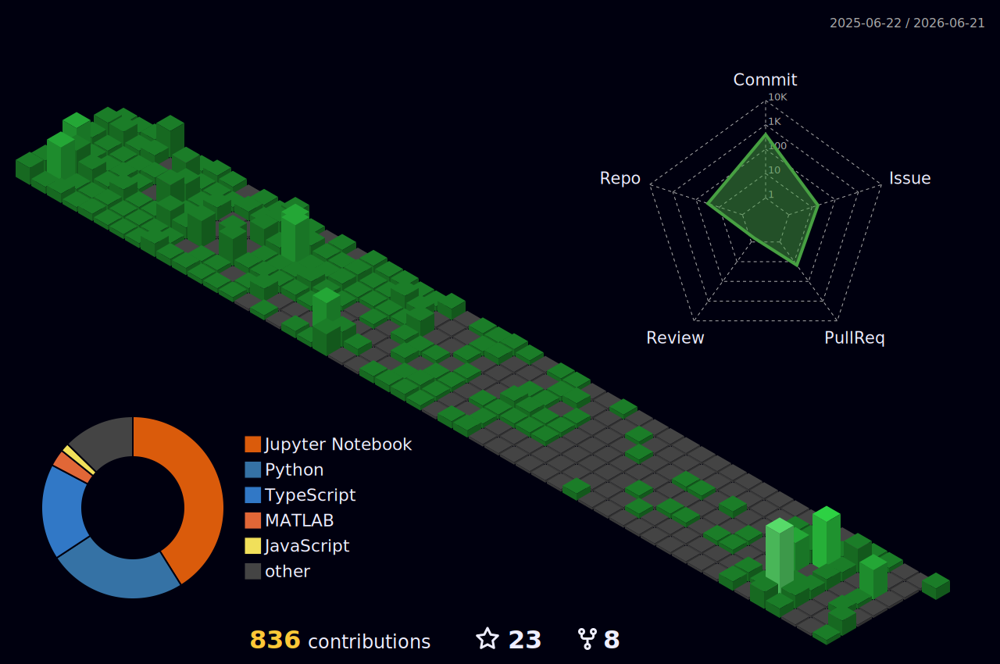

<h3 align="left">A Passionate Learner from India</h3>

  

- 👨‍💻 All of my projects are available at [https://dhyeyfindoriya.vercel.app/](https://dhyeyfindoriya.vercel.app/)

- 📫 How to reach me **b22ee024@iitj.ac.in**/ **findoriyadhyey@gmail.com**

&nbsp;

&nbsp;

