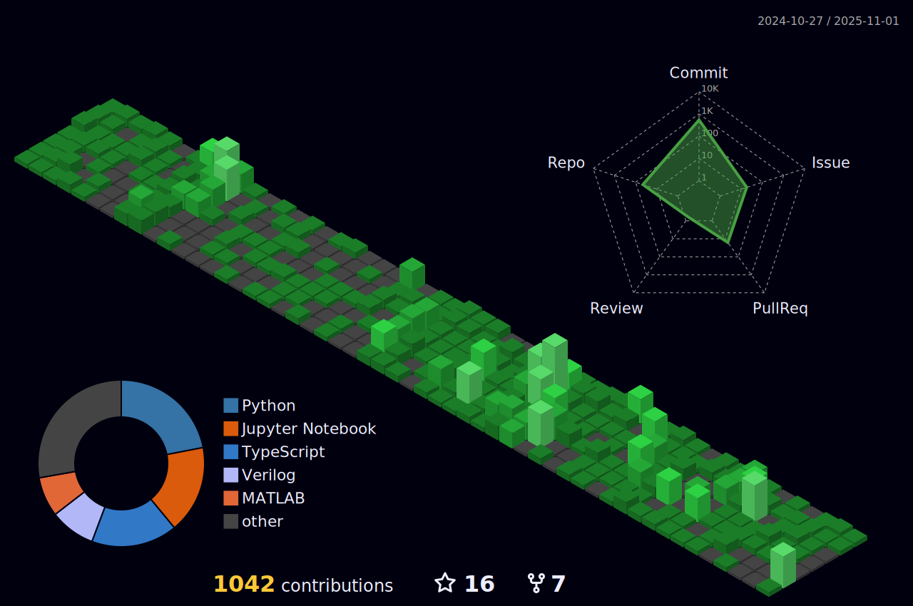

<h3 align="left">A Passionate Learner from India</h3>

  

- 👨‍💻 All of my projects are available at [https://dhyeyinf.github.io/dhyey323/](https://dhyeyinf.github.io/dhyey323/)

- 📫 How to reach me **b22ee024@iitj.ac.in**/ **findoriyadhyey@gmail.com**

<h3 align="left">Connect with me:</h3>

<h3 align="left">Languages and Tools:</h3>

                         

&nbsp;

